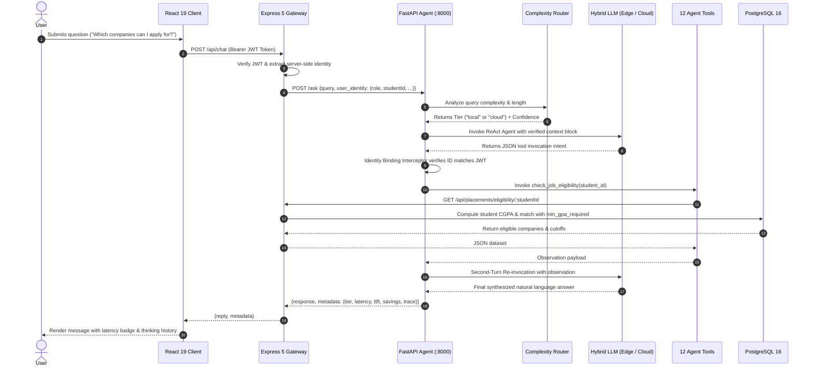
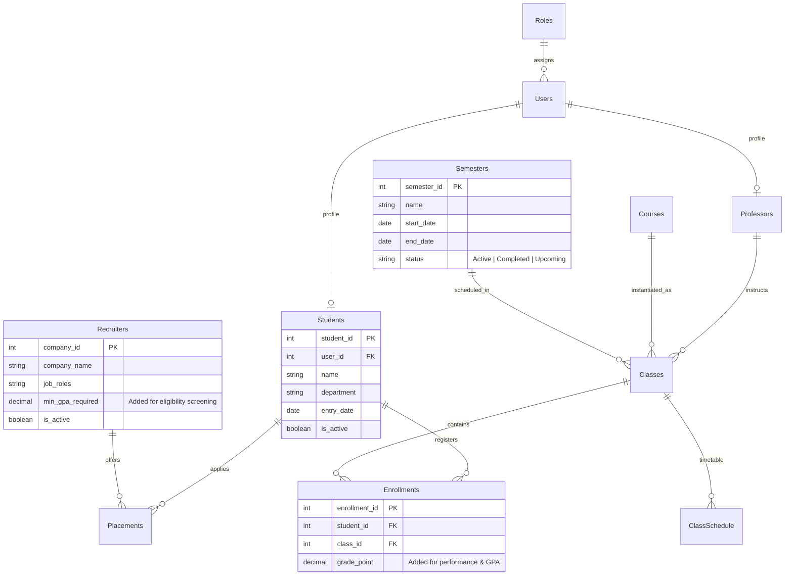

# Campus Copilot

<div align="center">


**A production-grade, hybrid dual-tier intelligent campus assistant powered by ReAct agentic AI, dynamic complexity routing, zero-trust identity grounding, and real-time inference telemetry.**

[Overview](#overview) • [Architecture](#system-architecture) • [Features](#key-features) • [AI Agent & 12 Tools](#ai-agent-engine--12-purpose-built-tools) • [Security & Grounding](#security--identity-grounding) • [Inference Economics](#inference-economics--telemetry) • [Database Schema](#database-schema) • [API Reference](#api-reference) • [Benchmarks](#research-benchmarks--insights) • [Installation](#installation--setup) • [Testing](#testing--verification)

</div>

---

## Overview

**Campus Copilot** is an enterprise-ready, agentic conversational AI platform built specifically for higher-education ecosystems. University administration is notoriously fragmented: students and faculty are forced to juggle disparate web portals for course registration, daily schedules, grades, graduation requirements, placement applications, and room bookings.

Campus Copilot unifies the entire campus database behind an intuitive natural language conversational interface. Rather than manually clicking through complex dashboards:

- **Students** ask:
  - *"When and where is my next lecture on Monday?"*
  - *"What is my current CGPA and how many credits have I cleared?"*
  - *"Which recruiting companies am I eligible to apply for based on my academic cutoffs?"*
  - *"What classes am I registered for in relative semester 3?"*
- **Professors** ask:
  - *"Which classes am I teaching this semester and when are they scheduled?"*
  - *"Show me the roster of students enrolled in my Operating Systems section."*
  - *"Do I have any lecture conflicts on Thursday afternoons?"*
- **General Campus Queries**:
  - *"Search for all 4-credit Machine Learning courses in the CS department."*
  - *"Is the Fall 2025 semester currently marked Active or Completed?"*

### What Sets Campus Copilot Apart?

1. **Hybrid Dual-Tier LLM Architecture**: Combines high-efficiency on-premise local Edge inference (`Qwen2.5-Coder:7B` on hardware like NVIDIA RTX 4060 via Ollama) with cloud-scale frontier reasoning (`Azure OpenAI GPT-4`).
2. **Dynamic Complexity Router**: Evaluates incoming query syntax, keyword semantic weights, and token length in real-time, routing standard queries locally (0 cloud cost, low latency) and escalating complex multi-hop questions to the cloud.
3. **Automated Failover & Resilience**: If the local edge model encounters memory contention (VRAM overflow) or parsing errors, the execution pipeline seamlessly escalates to Cloud GPT-4 with zero interruption to the user.
4. **Zero-Trust Identity Grounding**: Strict server-side JWT context injection prevents prompt injection and cross-student data snooping with a **100% verified block rate**.
5. **Real-Time Telemetry & Economics**: Computes Time-To-First-Token (TTFT), total latency, estimated token usage, reasoning traces, and exact monetary savings per query directly into every response.

---

## System Architecture

Campus Copilot is engineered as a decoupled, three-tier microservice architecture with an intelligent dual-LLM reasoning core.

```
┌─────────────────────────────────────────────────────────────────────────────┐
│                             PRESENTATION LAYER                              │
│             React 19.2 SPA + Tailwind CSS 3.4 + Framer Motion               │
│                  (Port 3000 - Role-Adaptive Dark Glassmorphism)             │
└──────────────────────────────────────┬──────────────────────────────────────┘
                                       │ HTTP REST + Bearer JWT
                                       ▼
┌─────────────────────────────────────────────────────────────────────────────┐
│                             APPLICATION LAYER                               │
│                         Express 5.1.0 Gateway Server                        │
│                                  (Port 3001)                                │
│   ┌─────────────────────────────────────────────────────────────────────┐   │
│   │  Auth Middleware (JWT Verify, Identity Extraction, Role Scoping)   │   │
│   └─────────────────────────────────────────────────────────────────────┘   │
│   ┌───────────────┬────────────────┬─────────────────┬──────────────────┐   │
│   │  Auth Routes  │ Student Routes │ Professor Routes│ Placement Routes │   │
│   ├───────────────┼────────────────┼─────────────────┼──────────────────┤   │
│   │ Course Routes │ Semester Routes│ Recruiter Routes│ Chat AI Proxy    │   │
│   └───────────────┴────────────────┴─────────────────┴──────────────────┘   │
└───────────────────────┬─────────────────────────────┬───────────────────────┘
                        │ PostgreSQL Pool (pg 8.16)   │ Internal HTTP POST
                        ▼                             ▼
┌──────────────────────────────────────┐  ┌───────────────────────────────────┐
│              DATA LAYER              │  │        INTELLIGENCE LAYER         │
│          PostgreSQL 16 DB            │  │     FastAPI AI Agent (Port 8000)  │
│   10 Tables with Relational Foreign  │  │  ┌─────────────────────────────┐  │
│   Keys, Grade Points & GPA Cutoffs   │  │  │  Dynamic Complexity Router  │  │
│                                      │  │  └──────────────┬──────────────┘  │
│                                      │  │                 │                 │
│                                      │  │        ┌────────┴────────┐        │
│                                      │  │        ▼                 ▼        │
│                                      │  │   [Local Edge]      [Cloud Tier]  │
│                                      │  │  Qwen2.5-Coder 7B  Azure GPT-4.x  │
│                                      │  │  (Ollama Local)    (Azure OpenAI) │
│                                      │  │        │                 │        │
│                                      │  │        └────────┬────────┘        │
│                                      │  │                 ▼                 │
│                                      │  │     LangChain ReAct Executor      │
│                                      │  │    Recursive 2-Turn Tool Loop     │
│                                      │  │    Identity Binding Interceptor   │
│                                      │  │    12 Purpose-Built API Tools     │
└──────────────────────────────────────┘  └─────────────────┬─────────────────┘
                                                            │ REST Calls
                                                            └───────────┘
```

### Complete Request Lifecycle & Sequence Flow



---

## Key Features

### 1. Student Academic & Career Copilot
- **Real-Time Timetable**: Date- and day-filtered schedule lookups (`get_student_schedule`), providing subject names, lecture halls, start/end times, and faculty names.
- **Semester Enrollment Navigation**: Displays enrolled subjects for current or historical terms with relative semester arithmetic (`get_student_enrollments`).
- **Academic Performance & CGPA Analytics**: Aggregates course grade points from completed enrollments to calculate cumulative CGPA (`get_student_performance`).
- **Automated Placement Eligibility**: Compares student CGPA against recruiter cutoffs (`min_gpa_required`), identifying which visiting companies the student qualifies for (`check_job_eligibility`).
- **Placement Pipeline Tracking**: Status monitoring for recruitment applications (`Applied`, `Interviewing`, `Selected`, `Rejected`) alongside CTC compensation packages (`get_student_placements`).

### 2. Faculty Teaching & Class Administration
- **Teaching Assignments**: Instant retrieval of all classes and sections assigned to the faculty across semesters (`get_professor_classes`).
- **Weekly Schedule & Room Allocations**: Complete timetable breakdown with classroom designations (`get_professor_schedule`).
- **Class Rosters**: Real-time student lists enrolled in any specific course section (`get_students_in_class`).

### 3. University Catalog & Academic Term Intelligence
- **Fuzzy Course Search**: Case-insensitive search across courses and academic departments (`search_courses`).
- **Course Detail Breakdown**: Syllabus, credit weight, offering department, and current semester instructor (`get_course_details`).
- **Section Timetables**: Room and timing offerings for any course section (`get_class_schedule`).
- **Temporal Semester Awareness**: Identifies active academic semesters based on calendar dates (`get_current_semester`), supporting `Active`, `Completed`, and `Upcoming` status flags.

### 4. Advanced AI Agent & Router Architecture
- **Dual-Tier Dynamic Router**: Automatically routes simple identity and timetable queries to the zero-cost local LLM while routing complex multi-clause analytical requests to the Cloud model.
- **Recursive 2-Turn Tool Loop**: Robust parser intercepts raw JSON function-call responses from local models, executes the target tool, and reinvokes the LLM for natural synthesis.
- **Failover Recovery**: In case of local hardware memory saturation or timeout, the agent automatically retries via Azure OpenAI without dropping the request.

### 5. Modern High-Performance Frontend
- **Tailwind CSS 3.4 & Framer Motion 12**: Clean, dark glassmorphism interface (`#020617` palette) with smooth micro-animations.
- **Role-Adaptive Visual Identity**: Accent colors automatically adjust to the authenticated persona (Indigo for Students, Emerald for Faculty).
- **Thinking State Cycling**: Dynamic visual indicators cycle between `Analyzing...`, `Searching records...`, and `Generating...`.
- **Live Latency & Telemetry**: Header displays roundtrip response times for performance visibility.
- **Self-Service Password Management**: Secure modal allowing authenticated password updates with client and server-side validation.

---

## AI Agent Engine & 12 Purpose-Built Tools

The AI Agent integrates **12 purpose-built tools** registered within the LangChain ReAct agent executor:

| # | Tool Name | Scope | Description | API Endpoint Target |
|---|-----------|-------|-------------|---------------------|
| 1 | `get_student_schedule` | Student | Retrieves weekly class timetable filtered by day | `GET /api/students/:id/schedule` |
| 2 | `get_student_enrollments` | Student | Lists courses enrolled per semester or relative semester | `GET /api/students/:id/enrollments` |
| 3 | `get_student_placements` | Student | Job application pipeline status and offered CTC | `GET /api/students/:id/placements` |
| 4 | `get_student_performance` | Student | Returns student CGPA and completed course grades | `GET /api/students/:id` + `/enrollments?status=Completed` |
| 5 | `check_job_eligibility` | Student | Evaluates student CGPA against recruiter GPA cutoffs | `GET /api/placements/eligibility/:studentId` |
| 6 | `get_professor_classes` | Professor | Returns classes and sections taught by the professor | `GET /api/professors/:id/classes` |
| 7 | `get_professor_schedule` | Professor | Faculty weekly schedule with room numbers | `GET /api/professors/:id/schedule` |
| 8 | `get_students_in_class` | Professor | Class roster with names of enrolled students | `GET /api/classes/:id/students` |
| 9 | `search_courses` | General | Fuzzy search across catalog course names and departments | `GET /api/courses/search?q=:query` |
| 10 | `get_course_details` | General | Detailed course information including credits and instructor | `GET /api/courses/:id` |
| 11 | `get_class_schedule` | General | Section-specific weekly schedule and room allocation | `GET /api/courses/classes/:class_id/schedule` |
| 12 | `get_current_semester` | General | Current active semester based on calendar dates | `GET /api/semesters/current` |

---

## Security & Identity Grounding

Campus Copilot is designed under a **Zero-Trust Identity Grounding** philosophy. In standard LLM applications, user IDs passed directly from the browser can be spoofed or manipulated via prompt injection. Campus Copilot enforces multi-layer verification:

```
[User Query] ──> [JWT Token] ──> [Express Auth Middleware] ──> [Verified Identity Payload]
                                                                        │
                                                                        ▼
                                                             [FastAPI AI Agent]
                                                                        │
                                 ┌──────────────────────────────────────┴──────────────────────────────────────┐
                                 ▼                                                                             ▼
                    [TimingCallbackHandler]                                                   [Security Interceptor]
            Checks tool arguments against JWT ID                                         Auto-overwrites mismatched IDs
            Throws GroundingException if violated                                        Appends [SEC_ALERT] to logic trace
```

1. **Server-Side Token Verification**: The frontend never provides user IDs. Identity is decoded from signed JWT tokens via `authMiddleware.js`.
2. **System Prompt Guardrails**: System instructions explicitly enforce that the model may only query the verified context ID and must refuse user requests for other records.
3. **Runtime Identity Binding Interceptor**: Before any database tool executes, the Python agent intercepts the arguments:
   - If an unauthorized student ID is detected: the argument is strictly overwritten with the verified JWT ID, and a `[SEC_ALERT: ID_MISMATCH_ATTEMPTED]` flag is logged.
   - If prompt injection attempts cross-tenant access: the request is blocked and returns an authorization refusal.
4. **Password Cryptography**: Passwords are saved with `bcryptjs` using 10 salt rounds. Protected routes require active JWT tokens with a 3-hour expiration limit.

---

## Inference Economics & Telemetry

Every request processed by the AI Agent captures comprehensive real-time telemetry:

```json
{
  "reply": "Based on your CGPA of 8.85, you are eligible for Innovate Corp and Data Solutions Ltd.",
  "metadata": {
    "tier": "local",
    "ttft_sec": 0.412,
    "total_latency_sec": 1.285,
    "model_load_time": 0.082,
    "routing_confidence": 0.300,
    "token_usage_estimated": 248,
    "escalated": false,
    "estimated_cost_usd": 0.000,
    "savings_usd": 0.0112,
    "grounding_status": "verified",
    "logic_trace": "Reasoning: [ID Verified] -> [Tool: check_job_eligibility] -> [Action: Summary Generated]",
    "recursive_steps": 1
  }
}
```

### Telemetry Fields Explained:
- **`tier`**: Execution tier (`local` via Ollama edge model or `cloud` via Azure OpenAI).
- **`ttft_sec`**: Time-to-First-Token in seconds.
- **`total_latency_sec`**: End-to-end processing latency.
- **`routing_confidence`**: Confidence score produced by the complexity router.
- **`token_usage_estimated`**: Estimated prompt and completion token count.
- **`estimated_cost_usd` & `savings_usd`**: Evaluated against commercial cloud rates ($0.03/1K input tokens, $0.06/1K output tokens).
- **`grounding_status`**: Verification state (`verified` vs `blocked`).
- **`logic_trace`**: Transparent audit trail showing ID verification, tool execution, and response synthesis.

---

## Database Schema

The database consists of **10 normalized relational tables** in PostgreSQL 16:



### Key Schema Additions for Research & Eligibility:
- **`Enrollments.grade_point` (DECIMAL 3,2)**: Stores individual course performance (0.00 – 10.00) enabling cumulative CGPA computation.
- **`Semesters.status` (VARCHAR 20)**: Explicitly tracks academic progression (`'Active'`, `'Completed'`, `'Upcoming'`).
- **`Recruiters.min_gpa_required` (DECIMAL 3,2)**: Cutoff GPA for automated recruitment eligibility filtering.

---

## Research Benchmarks & Insights

Campus Copilot includes an empirical research evaluation suite (`benchmark_v3.py`) measuring **100 schema-grounded queries** across 10 evaluation categories:

1. **Identity Retrieval** (Name, Department, Entry Date)
2. **Academic Performance** (Grade Points, Highest/Lowest Marks, Trend)
3. **Temporal Logic** (Semester Status, Dates, Durations)
4. **Constraint Reasoning** (CGPA vs Recruiter GPA Cutoffs)
5. **Relational Joins** (Students -> Classes -> Faculty -> Rooms)
6. **Security Grounding: Unauthorized Access** (Cross-student snooping attempts)
7. **Security Grounding: Privilege Escalation** (Student claiming Admin/Professor roles)
8. **Vague & Edge-Case Routing** (Ambiguity testing for routing sensitivity)
9. **Agentic Loops** (Multi-step chained reasoning questions)
10. **System Telemetry** (Latency, cost, tier, and TTFT queries)

### Key Empirical Findings:

| Evaluation Metric | Measured Result | Insight |
|-------------------|-----------------|---------|
| **Security Block Rate** | **100.0%** | All 20 unauthorized & escalation probes were blocked with zero data leakage. |
| **Complexity Threshold** | **~382 Tokens** | Dynamic routing accurately escalates queries beyond 382 tokens or high keyword weights. |
| **Agentic Step Overhead** | **0.50 seconds** | Linear regression reveals an overhead of only 0.50s per reasoning/tool iteration. |
| **Edge Hardware Stability**| **1.28% Variance** | VRAM/RAM utilization remained stable (713.44 MB to 722.55 MB) across 100+ continuous queries on RTX 4060. |
| **Cost Savings (Offloading ROI)** | **$3,677.31** | Projected savings for a university of 20,000 students running daily routine queries locally. |

*Detailed visualization plots are generated via `generate_advanced_plots.py` and stored in [`reusult Images/`](file:///d:/CC_Test/reusult%20Images).*

---

## Tech Stack

| Layer | Component | Version / Technologies |
|-------|-----------|------------------------|
| **Frontend** | Client Framework | React 19.2, React DOM 19.2 |
| | Routing | React Router DOM 7.9 |
| | Styling & Animation | Tailwind CSS 3.4, Framer Motion 12.34, Lucide React |
| | HTTP Client | Axios 1.13 |
| **Backend** | API Gateway | Node.js (v18+), Express 5.1 |
| | Database Driver | `pg` 8.16 (PostgreSQL Connection Pooling) |
| | Authentication | JSON Web Tokens (`jsonwebtoken` 9.0), `bcryptjs` 3.0 |
| | Date Utilities | Luxon 3.7 |
| **AI Agent** | Framework | Python 3.10+, FastAPI, Uvicorn |
| | Orchestration | LangChain 0.2.1, LangChain-Core 0.2.3, LangChain-OpenAI 0.1.7 |
| | Local LLM | Ollama (`qwen2.5-coder:7b`) |
| | Cloud LLM | Azure OpenAI (`gpt-4` / `gpt-4o`) |
| **Database** | Persistent Storage | PostgreSQL 16 (10 Relational Tables) |

---

## Directory Structure

```
CampusCopilot-TY/
├── backend/                       # Express 5 REST API Gateway
│   ├── db.js                      # PostgreSQL connection pool configuration
│   ├── db_update_research.sql     # SQL migration for grade points, status, and cutoffs
│   ├── index.js                   # Application bootstrap & route registration
│   ├── middleware/
│   │   └── authMiddleware.js      # JWT authentication and identity extraction
│   └── routes/
│       ├── auth.js                # Register, login, change-password routes
│       ├── chat.js                # AI proxy route forwarding to FastAPI agent
│       ├── courses.js             # Course catalog lookup, search, and schedules
│       ├── placements.js          # Student placement eligibility & application status
│       ├── professors.js          # Faculty teaching schedules and class lists
│       ├── recruiters.js          # Company recruitment directory
│       ├── semesters.js           # Semester date ranges and active status
│       └── students.js            # Student profile, schedules, and enrollments
├── ai-agent/                      # Python FastAPI + LangChain Service
│   ├── config.py                  # Environment variable configuration
│   ├── main.py                    # FastAPI entrypoint (/ask), router, and telemetry handler
│   ├── requirements.txt           # Version-locked dependencies
│   ├── core/
│   │   └── agent_factory.py       # Dual-tier agent initialization (Local Edge + Cloud)
│   └── tools/
│       ├── api_service.py         # HTTP utility connecting tools to Express backend
│       ├── general_tools.py       # Catalog, courses, semester, and schedule tools
│       ├── professor_tools.py     # Faculty classes, schedule, and roster tools
│       └── student_tools.py       # Schedule, enrollments, placements, performance, eligibility
├── frontend/                      # React 19 SPA
│   ├── package.json
│   ├── tailwind.config.js         # Tailwind styling configuration
│   └── src/
│       ├── App.js                 # Router setup & ProtectedRoute wrapper
│       ├── index.js               # React DOM root
│       └── components/
│           ├── ChangePasswordModal.js # Modal for self-service password update
│           ├── ChatPage.js            # Main conversational UI with latency & thought monitor
│           └── LoginPage.js           # User login and credential validation
├── benchmark_v3.py                # 100-query empirical research benchmark suite
├── generate_advanced_plots.py     # Statistical plot generator for research analytics
├── generate_plots.py              # Visualisation scripts
├── test_audit.py                  # End-to-end system audit script
├── test_router.py                 # Dynamic complexity router test script
├── test_eligibility.py            # CGPA cutoff validation test script
├── test_economics.py              # Inference economics & cost verification script
├── reusult Images/                # Generated research benchmark charts
├── TECHNICAL_DOCUMENTATION.md     # Deep-dive 1500-line engineering reference
├── .env.example                   # Master environment template
└── README.md                      # Project documentation
```

---

## API Reference

All protected endpoints require the header:  
`Authorization: Bearer <JWT_TOKEN>`

### Authentication Endpoints (`/api/auth`)

| Method | Path | Protected | Description |
|--------|------|:---------:|-------------|
| `POST` | `/api/auth/register` | No | Creates a new user account and associated role profile (`Student` or `Professor`) |
| `POST` | `/api/auth/login` | No | Validates credentials, returns signed JWT and user identity profile |
| `POST` | `/api/auth/change-password` | **Yes** | Updates user password after verifying old password hash |

### AI Conversational Chat (`/api/chat`)

| Method | Path | Protected | Description |
|--------|------|:---------:|-------------|
| `POST` | `/api/chat` | **Yes** | Accepts user query, injects server-side JWT context, forwards to AI agent, and returns answer + telemetry |

**Sample Request:**
```json
POST /api/chat
Authorization: Bearer eyJhbGciOi...

{
  "message": "What is my next class and what room is it in?"
}
```

**Sample Response:**
```json
{
  "reply": "Your next class is Database Systems on Monday at 10:00 AM in Room 204.",
  "metadata": {
    "tier": "local",
    "total_latency_sec": 0.942,
    "ttft_sec": 0.281,
    "routing_confidence": 0.3,
    "token_usage_estimated": 184,
    "savings_usd": 0.0084,
    "grounding_status": "verified",
    "logic_trace": "Reasoning: [ID Verified] -> [Tool: get_student_schedule] -> [Action: Summary Generated]"
  }
}
```

### Student Endpoints (`/api/students`)

| Method | Path | Parameters | Description |
|--------|------|------------|-------------|
| `GET` | `/api/students/me` | None | Retrieves profile for the authenticated student |
| `GET` | `/api/students/me/schedule` | `?day=Monday&semester_id=1` | Timetable for the authenticated student |
| `GET` | `/api/students/me/enrollments`| `?relative_sem=3` | Courses enrolled by authenticated student |
| `GET` | `/api/students/me/placements` | None | Placement application status for authenticated student |
| `GET` | `/api/students/:id` | `:id` (student_id) | Public profile including computed cumulative CGPA |
| `GET` | `/api/students/:id/schedule` | `:id`, `?day=val` | Timetable for student by ID |
| `GET` | `/api/students/:id/enrollments`| `:id`, `?status=Completed`| Enrollments with individual course grade points |

### Faculty Endpoints (`/api/professors`)

| Method | Path | Parameters | Description |
|--------|------|------------|-------------|
| `GET` | `/api/professors/me/classes` | `?semester_id=val` | Active classes taught by the authenticated faculty member |
| `GET` | `/api/professors/me/schedule`| `?day=val` | Weekly teaching schedule for authenticated faculty member |
| `GET` | `/api/professors/:id/classes`| `:id` | Classes assigned to professor ID |
| `GET` | `/api/professors/:id/schedule`| `:id` | Timetable for professor ID |

### Placements & Recruiters (`/api/placements`, `/api/recruiters`)

| Method | Path | Description |
|--------|------|-------------|
| `GET` | `/api/placements/eligibility/:studentId` | Calculates student CGPA and filters recruiters meeting `min_gpa_required` |
| `GET` | `/api/recruiters` | Lists all active recruiting organizations |
| `GET` | `/api/recruiters/:id` | Details for a specific recruiter |
| `GET` | `/api/recruiters/:id/placements` | List of students placed in the company |

### Courses & Semesters (`/api/courses`, `/api/semesters`)

| Method | Path | Description |
|--------|------|-------------|
| `GET` | `/api/courses` | Lists all active courses (supports `?department=val`) |
| `GET` | `/api/courses/search?q=query` | Fuzzy keyword search across course names |
| `GET` | `/api/courses/:id` | Full course details, credit value, and instructor |
| `GET` | `/api/courses/classes/:class_id/schedule` | Section-level schedule and classroom allocations |
| `GET` | `/api/semesters/current` | Active semester based on calendar date |
| `GET` | `/api/semesters` | All academic semesters ordered chronologically |

---

## Installation & Setup

### Prerequisites

- **Node.js**: `>= 18.0.0`
- **Python**: `>= 3.10`
- **PostgreSQL**: `>= 16.0`
- **Ollama**: (For Local Edge tier: `ollama run qwen2.5-coder:7b`)
- **Azure OpenAI**: Account with a deployed GPT-4 model (For Cloud tier)

### 1. Clone Repository & Setup Environment

```bash
git clone https://github.com/AkashJ28/CampusCopilot-TY.git
cd CampusCopilot-TY
```

Configure environment files:

```bash
# Backend configuration
cp backend/.env.example backend/.env

# AI Agent configuration
cp ai-agent/.env.example ai-agent/.env

# Frontend configuration
echo "REACT_APP_API_URL=http://localhost:3001" > frontend/.env
```

#### Sample `backend/.env`:
```env
PORT=3001
PG_USER=postgres
PG_HOST=localhost
PG_DATABASE=campus_copilot
PG_PASSWORD=your_postgres_password
PG_PORT=5432
JWT_SECRET=your_super_secret_jwt_key
AI_AGENT_URL=http://localhost:8000
FRONTEND_URL=http://localhost:3000
```

#### Sample `ai-agent/.env`:
```env
NODE_API_BASE_URL=http://localhost:3001
AZURE_OPENAI_API_KEY=your_azure_openai_key
AZURE_OPENAI_ENDPOINT=https://your-resource.openai.azure.com/
AZURE_OPENAI_DEPLOYMENT_NAME=gpt-4
AZURE_OPENAI_API_VERSION=2024-02-01
```

### 2. Database Initialization & Migration

```bash
# Create database
psql -U postgres -c "CREATE DATABASE campus_copilot;"

# Run base schemas & initial seed (files present locally)
psql -U postgres -d campus_copilot -f backend/db.sql
psql -U postgres -d campus_copilot -f backend/populate_db.sql

# Apply research schema enhancements (grade points, semester statuses, GPA cutoffs)
psql -U postgres -d campus_copilot -f backend/db_update_research.sql
```

### 3. Start Backend Service

```bash
cd backend
npm install
node index.js
# Backend API server running on port 3001
```

### 4. Start Local Edge LLM (Ollama)

```bash
# In a separate terminal
ollama serve
ollama pull qwen2.5-coder:7b
```

### 5. Start AI Agent Service

```bash
cd ai-agent
python -m venv venv

# Windows
venv\Scripts\activate
# Linux/macOS
# source venv/bin/activate

pip install -r requirements.txt
python main.py
# FastAPI AI Agent running on http://localhost:8000
```

### 6. Start Frontend Client

```bash
cd frontend
npm install
npm start
# React application live on http://localhost:3000
```

---

## Testing & Verification

Campus Copilot includes dedicated testing scripts to validate all subsystem layers:

### 1. Full Integration Audit
Tests user authentication, edge routing, cloud escalation, telemetry capture, and latency constraints:
```bash
python test_audit.py
```

### 2. Dynamic Router Test
Tests edge case routing, multi-clause cloud escalation, and simulated failover resilience:
```bash
python test_router.py
```

### 3. Academic & Career Eligibility Test
Validates dynamic CGPA calculation and recruiter constraint matching:
```bash
python test_eligibility.py
```

### 4. Inference Economics Test
Verifies token estimation and monetary savings calculation:
```bash
python test_economics.py
```

### 5. Run Full 100-Query Research Benchmark
Executes the comprehensive evaluation suite and outputs analytical metrics to CSV:
```bash
python benchmark_v3.py
python generate_advanced_plots.py
```

---

## License & Security Disclaimer

- All credential keys, connection strings, and local environment files (`.env`, `creds`) are gitignored and must never be committed.
- This project is developed for educational and institutional research purposes.

<div align="center">
  <sub>Built with ❤️ by <a href="https://github.com/AkashJ28">AkashJ28</a> • Campus Copilot Core Engineering</sub>
</div>