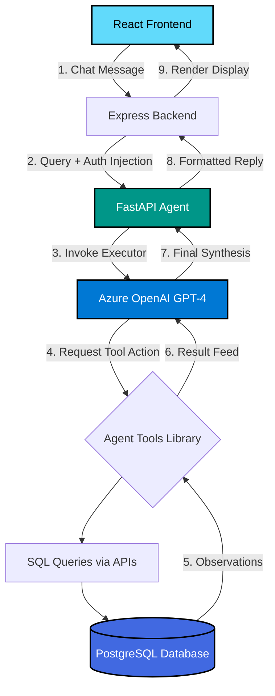

# 🎓 Campus Copilot

<div align="center">


**An intelligent campus assistant powered by ReAct agentic AI architecture.**

[Features](#-features) • [Architecture](#-architecture) • [Installation](#-installation) • [API Documentation](#-api-documentation)

</div>

---

## 📋 Table of Contents

- [Overview](#-overview)
- [Architecture](#-architecture)
- [Features](#-features)
- [Tech Stack](#-tech-stack)
- [Directory Structure](#-directory-structure)
- [Installation](#-installation)
- [API Documentation](#-api-documentation)
- [AI Agent Logic](#-ai-agent-logic)

---

## 🌟 Overview

**Campus Copilot** is a full-stack, intelligent assistant system designed exclusively for university environments. By leveraging an advanced Artificial Intelligence layer, the platform efficiently handles complex queries relating to student course schedules, active enrollments, job placements, and professor teaching rosters. 

It abstracts away traditional click-heavy navigation, providing an integrated chat interface that processes natural language requests into direct database operations.

---

## 🏗️ Architecture

### System Architecture Pattern: **ReAct Agent**

This project implements a **ReAct (Reasoning + Acting)** agentic pattern using LangChain and Azure OpenAI, where the LLM continuously iterates through:

1. **Reasoning:** Dynamically analyzing the user's explicit query against the available toolkit and identifying missing parameters.
2. **Acting:** Invoking dedicated backend API Tools securely (sandboxed to the authenticated user's ID).
3. **Observing:** Processing the JSON database responses gathered from the actions.
4. **Responding:** Synthesizing the raw data returned into a conversational, easy-to-read answer.

### Request Flow Diagram



---

## ✨ Features

### 🎓 Student Management
- **Schedules:** Dynamically check daily and weekly class timings and rooms.
- **Enrollments:** Review total credits and registered courses per semester.
- **Placements & Eligibility:** Calculate CGPA in real-time and compare it against recruiter Minimum GPA requirements for job availability.

### 👨‍🏫 Professor Management
- **Rosters:** View class lists and student tracking.
- **Teaching Assignments:** Review assigned courses separated by operational semesters.
- **Schedules:** Dedicated weekly teaching timetables.

### 📚 Course Management
- **Search:** Query overarching university catalog availability with fuzzy definitions.
- **Lookups:** Provide credit structures and department details for overarching classes.

### 🤖 AI-Powered Features
- **Context-Aware Memory:** Scopes all data requests utilizing implicit User Identifiers mapped from the original login context, eliminating ID spoofing.
- **Multi-Tool Routing:** Can execute 4+ APIs simultaneously to cross-reference constraints (e.g., matching jobs to calculated grades).

### 🔐 Security
- **Identity Middleware:** Full JWT intercept layers across all API boundaries preventing unauthorized database access.
- **Auth Protocols:** Encrypted bcrypt password hashing.

---

## 🛠️ Tech Stack

### Backend (Node.js/Express 5.1.0)
```json
{
  "dependencies": {
    "express": "^5.1.0",
    "pg": "^8.16.3",
    "jsonwebtoken": "^9.0.2",
    "bcrypt": "^6.0.0",
    "cors": "^2.8.5",
    "dotenv": "^17.2.3",
    "axios": "^1.12.2",
    "luxon": "^3.7.2"
  }
}
```

### Frontend (React 19.2.0)
```json
{
  "dependencies": {
    "react": "^19.2.0",
    "react-dom": "^19.2.0",
    "react-router-dom": "^7.9.5",
    "axios": "^1.13.1",
    "framer-motion": "^12.0.0",
    "lucide-react": "^0.474.0"
  }
}
```

### AI Agent (Python/FastAPI)
```txt
fastapi
uvicorn[standard]
requests
python-dotenv
langchain==0.2.1
langchain-core==0.2.3
langchain-openai==0.1.7
```

---

## 📁 Directory Structure

```
CC_Test/
├── backend/                      # Node.js Express API server
│   ├── index.js                  # Gateway / Express bootstrapper
│   ├── db.sql                    # PostgreSQL Schema declarations
│   └── routes/                   # Segmented API definitions (Auth, Chat, Students)
│
├── frontend/                     # React Single-Page Application
│   ├── src/index.js              # Application Mount
│   └── src/components/
│       ├── LoginPage.js          # Authentication Interface
│       └── ChatPage.js           # ReAct Query Interface and Data Visualizer
│
└── ai-agent/                     # Python Operational Tier
    ├── main.py                   # FastAPI /ask handler serving LangChain execution
    ├── core/agent_factory.py     # Invokes LangChain tools and Azure OpenAI wrappers
    └── tools/                    # Tool blocks translated from string queries to REST calls
```

---

## 🚀 Installation

Follow these steps to configure the system locally.

### 1. Clone the Repository
```bash
git clone <repository-url>
cd CC_Test
```

### 2. Database Setup
```bash
psql -U postgres
CREATE DATABASE campus_copilot;
\q
psql -U postgres -d campus_copilot -f backend/db.sql
psql -U postgres -d campus_copilot -f backend/populate_db.sql
```

### 3. Backend Setup
```bash
cd backend
npm install
# Configure your .env (PORT=3001, DATABASE_URL, JWT_SECRET)
npm start
```

### 4. AI Agent Setup
```bash
cd ai-agent
python -m venv venv
venv\Scripts\activate  # Windows || source venv/bin/activate (Mac/Linux)
pip install -r requirements.txt
# Configure your .env (AZURE_OPENAI_API_KEY, AZURE_OPENAI_ENDPOINT)
python main.py
```

### 5. Frontend Setup
```bash
cd frontend
npm install
npm start
```

### 6. Verification
Open your browser to `http://localhost:3000`. You will be greeted by the Authentication gateway.

---

## 📡 API Documentation

### Auth Endpoints

#### POST `/api/auth/login`
Validates credentials and provisions session tokens.

**Request:**
```json
{
  "email": "student@university.edu",
  "password": "SecurePass123"
}
```

**Response:**
```json
{
  "message": "Login successful",
  "token": "eyJhbG...",
  "user": {
    "role": "Student",
    "name": "Jane Doe",
    "studentId": 1
  }
}
```

### Chat Endpoints

#### POST `/api/chat`
Intercepts secure user sessions and forwards implicit constraints to the Agentic Python backend.

**Request:**
```json
{
  "message": "When is my next class?"
}
```

**Response:**
```json
{
  "reply": "Your next scheduled class is Operating Systems at 10:00 AM on Monday.",
  "metadata": {
      "tier": "cloud",
      "total_latency_sec": 3.4
  }
}
```

### Student Endpoints
- `GET /api/students/:id` - Fetch base profile.
- `GET /api/students/:id/schedule` - Generate weekly mappings.
- `GET /api/placements/eligibility/:studentId` - Maps dynamic CGPA grades against open recruiter thresholds.

### Professor Endpoints
- `GET /api/professors/:id/classes` - Core teaching assignments.
- `GET /api/professors/:id/schedule` - Structured timetable delivery.

### Course Endpoints
- `GET /api/courses/search?query=val` - Fuzzy DB match for catalog operations.

---

## 🧠 AI Agent Logic

The system utilizes an aggressive **LangChain Tool Calling** integration mapping natural language directly into deterministic API hits. The Executor assesses user constraints, dynamically chaining responses from the **10 specifically registered API Tool blocks** back through ReAct observation matrices.

### The 10 Available Agent Tools

#### 🎓 Student Tools (3)
1. `get_student_schedule`: Obtains operational classroom times.
2. `get_student_enrollments`: Aggregates active subjects scaling to specified semesters.
3. `get_student_placements`: Synthesizes application status data structures.

#### 👨‍🏫 Professor Tools (3)
4. `get_professor_classes`: Matches assignment arrays to the active profile identifier.
5. `get_professor_schedule`: Maps structural time-grids.
6. `get_students_in_class`: Extracts Roster endpoints securely.

#### 🌐 General Tools (4)
7. `search_courses`: Handles broader informational queries.
8. `get_course_details`: Emits exact credit structure and constraints.
9. `get_class_schedule`: Universal section query mapping.
10. `get_current_semester`: Evaluates live dates against static semester boundaries.

---

<div align="center">
Built with ❤️
</div>
